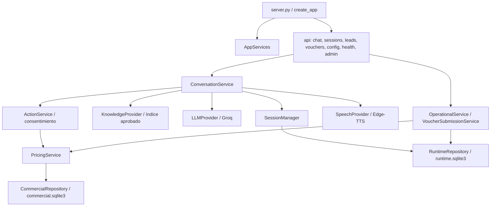

# Fase 6 — Arquitectura y reducción de duplicación

Fecha: 2026-10-07. Alcance: refactor incremental; sin cambios de diseño, UX, esquemas comerciales/operativos, proveedores ni parámetros del índice aprobado. No se inició Fase 7.

## Mapa antes y después

| Área | Antes | Después |
|---|---|---|
| Aplicación | server.py: arranque, middleware, transporte y negocio | server.py: factory create_app, middleware, routers, composición y lifecycle |
| Conversación | preparación y finalización repetidas entre /chat y /chat/stream | ConversationService: prepare, provider_arguments, resolve_actions, supplements, audio, commit; adaptadores complete/events |
| SSE | SDK, parser, TTS, reglas y encoding en una función anidada | GroqProvider normaliza deltas; StreamAssembly ensambla; ConversationService ordena; api/chat.py valida y codifica |
| Comprobantes | asociación, tarifa, decodificación y persistencia en ruta | VoucherSubmissionService orquesta; validador de imagen y OperationalService conservan sus controles |
| Prospectos | creación del servicio dentro de la ruta | servicio operativo suministrado por AppServices; router sólo valida y adapta |
| Administración | servicio creado implícitamente por petición | dependencia usa composición de app o una sustitución explícita de app.state |
| Configuración pública | compartía módulo con CRUD administrativo | api/public_config.py; contrato de salida sin cambios |
| Sesiones | errores HTTP dentro del servicio | SessionError desde servicio; security/http.py traduce errores seguros |
| Precios | modelos de persistencia importaban el servicio de precios | domain/pricing.py: modelos y conceptos independientes; reexports para compatibilidad |
| Integridad Chroma | consultas SQLite en knowledge_index.py | persistence/chroma_integrity.py, adaptador de sólo lectura; mismas verificaciones |
| Configuración operativa | getenv en sesiones, repositorio y runtime comercial | runtime_config.py; config.py compone configuración con validadores especializados SECURITY/CHROMA |
| Frontend | módulos separados con estado local de cliente y cola de audio | conservado; no se justificó añadir otro contenedor de estado |

## Responsabilidades y contratos

- Routers: Pydantic/formularios, invocación de servicios, HTTP/JSON/SSE. Continúan exactamente las rutas públicas y administrativas existentes.
- ConversationService: propiedad del turno, persona/dispositivo, contexto limitado, recuperación y proveedor, delegación de políticas, audio, commit condicionado y cleanup. No contiene SQL ni imports de FastAPI/Starlette.
- ActionService: delega a la política estructurada existente, con PricingService inyectado. El consentimiento sigue en consent_service.py. Ningún parámetro financiero procede del LLM.
- PricingPolicy: reutiliza sanitización y respuestas comerciales existentes con el mismo PricingService de la aplicación.
- Proveedores: Protocols LLMProvider, SpeechProvider y KnowledgeProvider, con adaptadores GroqProvider, EdgeSpeechProvider y AcademicKnowledgeProvider. El SDK sólo se interpreta en su adaptador. La configuración y el cliente Groq se proporcionan explícitamente; el cliente se cierra al apagar la app con espera acotada.
- Persistencia: SQL en repositorios/adaptadores. commercial.sqlite3 y runtime.sqlite3 continúan separados, sin migración de esquema. fingerprint se comparte desde domain/idempotency.py sin acoplar operaciones al adaptador SQLite.
- Errores: SessionError, ProviderTimeout, ProviderUnavailable y CommercialInputError se traducen en la frontera HTTP; los conflictos del repositorio siguen su contrato RuntimeConflict. Se conservan CatalogError e IndexErrorControlled y los mensajes públicos sanitizados.
- Sesiones: concurrencia, reemplazo explícito, expiración, idempotencia, cancelación, credenciales y transacciones no cambiaron. Al cerrar el adaptador SSE se cierra explícitamente el generador interno bajo protección de cancelación.

JSON y SSE usan las mismas funciones de preparación, autorización, respuesta comercial, audio y confirmación. complete/events son adaptadores de ejecución distintos porque el primero sintetiza una respuesta completa y el segundo sintetiza oraciones. El orden SSE permanece text/audio → ui_action → notices cuando corresponda → done; no se emiten acciones canceladas. Los nombres de eventos, IDs, DTOs y encabezados de transporte se conservan.

## Duplicación y legado

Eliminado ahora:
- preparación repetida de sesión/persona/contexto;
- argumentos repetidos del proveedor y decisiones repetidas sobre textos comerciales/fallback;
- manejo repetido de audio y su degradación controlada;
- helper SSE mode_switch sin consumidores y creación del directorio vacío de leads JSON;
- escritor save_voucher de JSON separado, sin llamadas desde aplicación, scripts o tests; su import muerto en pruebas también se retiró;
- imports realmente sin uso tras las extracciones.

Mantenido temporalmente:
- LegacyActionAdapter, legacy_request, validar_accion y resolver_pago: compatibilidad probada de Fases 1/1.5. Las etiquetas se convierten internamente a solicitudes y pasan por las mismas validaciones; jamás viajan a voz/frontend.
- seis pricing JSON: migración/compatibilidad temporal, nunca fuente primaria del runtime;
- funciones de proveedor y wrappers comerciales para scripts/pruebas históricas; clientes SDK de compatibilidad se crean sólo al invocarse. El runtime usa composición explícita.
- helpers/reexports usados por cargadores, scripts y regresiones. Las referencias locales de compatibilidad action_service ↔ llm_protocol no producen instanciación al importar.
- acoplamiento local del CLI ingest/rebuild al cargador; no se reescribió la generación aprobada del índice.

Retiro posterior: compatibilidad de etiquetas/JSON cuando se cierre su ventana de migración; autenticación administrativa definitiva y escalamiento distribuido continúan fuera de esta fase.

## Archivos

Nuevos de implementación (17):
- backend/api/{chat,dependencies,health,leads,public_config,sessions,vouchers}.py
- backend/app_services.py
- backend/domain/{__init__,errors,pricing,idempotency}.py
- backend/runtime_config.py
- backend/persistence/chroma_integrity.py
- backend/services/{conversation_service,providers,voucher_submission}.py

Pruebas/informe nuevos: backend/tests/test_phase6.py; docs/fase-6.md; docs/fase-6-evaluacion.json.

Modificados: server.py, api/commercial.py, commercial_runtime.py, config.py, session_manager.py, persistence/{models,sqlite_repository,sqlite_runtime_repository}.py, services/{action_service,commercial_service,llm_protocol,llm_service,pricing_service,rag_service,operational_service,tts_service,voucher_service}.py, security/{http,providers}.py, requirements.txt, .env.example y fixtures de tests {test_phase1_api,test_dynamic_pricing,test_phase15,test_phase16,test_security}.py. No se modificaron archivos frontend ni Markdown académicos en Fase 6. Los cambios visibles en git de fases anteriores se conservaron.

Archivos eliminados: ninguno.

## Dependencias y configuración

Retiradas de requirements: langchain, langchain-community, pypdf y docx2txt. Se revisaron runtime, ingestión, rebuild, scripts administrativos y tests. Además, el arranque real, /health/ready, /api/config y chunking de 66 fragmentos se verificaron bloqueando imports de los cuatro paquetes retirados.

Conservadas: langchain-core y langchain-text-splitters, usados por Document y chunking. pydantic-settings se conserva porque ChromaDB lo requiere; se comprobó tanto su metadata como readiness. PyYAML y anyio pasan a figurar explícitamente: ya estaban instalados y son imports directos del proyecto. No se añadieron bibliotecas ni frameworks funcionales nuevos. pip check no detectó dependencias rotas. No se desinstalaron paquetes del entorno existente.

La configuración permanece agrupada por responsabilidad: config.py para proveedores/app, runtime_config.py para rutas privadas/sesiones/SQLite/token, security/config.py para seguridad y knowledge_config.py para índice. No se leen variables de entorno en routers o servicios de negocio. .env se resuelve desde backend; .env.example mantiene nombres y ejemplos, sin secretos.

## Métricas

| Medida | Antes | Después |
|---|---:|---:|
| Líneas server.py | 430 | 48 |
| Función principal streaming, incluyendo transporte | 108 | router 14; ejecución de eventos 71 |
| JSON: políticas compartidas | copia propia | prepare/arguments/actions/supplements/audio/commit compartidos |
| Funciones principales de server | rutas + helpers + lifecycle | create_app y lifespan |

Las medidas indican separación, no reducción artificial: el código se movió a capas con contratos e inyección; los adaptadores JSON/SSE conservan sus diferencias necesarias.

## Verificación y límites

Resultados definitivos:

| Comprobación | Resultado |
|---|---|
| Suite backend completa | 162/162; 10 regresiones nuevas, 152 anteriores |
| Suite frontend completa | 26/26 |
| Concurrencia/cancelación real sobre repositorio y HTTP | incluida y aprobada |
| Evaluación RAG real | 12/12 casos; 66 chunks conservados |
| rebuild_knowledge.py --check | ready |
| Arranque real, health/live, health/ready, api/config | HTTP 200 |
| npm run build | aprobado; advertencia previa de bundle >500 kB |
| Sintaxis Python / JavaScript | 77 / 16 archivos correctos |
| git diff --check y whitespace de archivos nuevos | sin errores; avisos de conversión LF/CRLF de Git |
| pip check | No broken requirements found |

Durante la extracción se detectaron y corrigieron errores de indentación, puntos de mock que dependían de globals y dos imports todavía necesarios. La ejecución definitiva pasó después de todas las correcciones; no hay regresiones conocidas. Las pruebas específicas incluyen núcleo común, catálogo inyectado autoritativo, errores sanitizados, fragmentación/truncación, cierre SSE antes de audio/acciones, configuración de voz explícita, archivos rechazados cerrados y límites privados. Las regresiones anteriores mantienen sus aserciones; los mocks que parcheaban globals del servidor ahora parchean los puertos de la composición.

Se verifica recuperación real contra lia_knowledge sin regenerar/promover índice. Modelo, dimensión, chunking, umbrales, selector, manifiesto y 66 chunks se conservan. El informe de los 12 casos está en fase-6-evaluacion.json.

Deuda/limitaciones: todavía hay compatibilidad global para scripts históricos, administración con Bearer temporal y SQLite/rate limiter de una instancia. No se llamaron Groq/Edge-TTS reales para estas regresiones: se verificaron adaptadores con dobles; RAG sí usa embeddings/Chroma reales. No se realizó una instalación limpia desde cero; se verificaron metadata, pip check y bloqueo de imports retirados. La advertencia existente del bundle Vite de 783.12 kB queda para la fase de rendimiento. No se cambiaron las reglas comerciales, campañas, avatares, UX ni se añadieron nuevas funcionalidades públicas.
